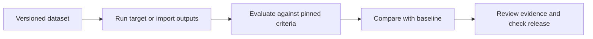

<p align="center">
  
</p>
<h1 align="center">EvalDock</h1>

**A workbench for engineers to evaluate AI outputs, compare changes, and catch regressions before release.**

[Local demo](http://localhost:5188) · [Documentation](docs/README.md) · [Report a bug](CONTRIBUTING.md#reporting-bugs)


## Why this exists

A promising output does not tell you whether a prompt or model change improves the whole application. EvalDock turns saved examples into repeatable experiments, so engineers can inspect regressions, preserve evidence, and make release decisions against explicit criteria.

## What it does

- **Compare changes:** pair baseline and candidate results, filter regressions, and inspect field-level differences.
- **Preserve evidence:** version datasets, targets and evaluation suites; retain outputs, attempts and independent human assessments.
- **Check releases:** enforce score, coverage, error and regression limits; export JSON/JUnit reports and CI exit codes.
- **Evaluate different systems:** call JSON HTTP targets, use OpenAI structured generation, or import existing outputs and traces.

## How it works



Only case input goes to the target. Evaluators use the configured reference or context, while human reviews remain separate from automated judgments. Saved outputs can be rescored without calling the target again.

### Architecture

| Area | Technology | Responsibility |
| --- | --- | --- |
| Application | Vue 3, TypeScript, Vite, FastAPI | Editors, comparison UI and scoped API |
| Data | PostgreSQL 17, SQLAlchemy, Alembic | Versioned resources, results and audit records |
| Jobs | Procrastinate, PostgreSQL | Durable execution, retries and worker recovery |
| AI | OpenAI Responses API, Pydantic, JSON Schema | Structured generation and validated judgments |
| Observability | Persisted events, attempts and usage metadata | Inspect progress, failures, latency and token usage |
| Local runtime | Docker Compose, nginx | Run the stack and proxy same-origin requests |

See [architecture and delivery semantics](docs/ARCHITECTURE.md).

## Quick start

### Requirements

- Docker with Compose v2.
- Python 3.12+ for local configuration; application runtimes run inside Docker.
- On Windows, use WSL for the commands below.

### Installation

From the downloaded or cloned repository root:

```bash
python3 scripts/configure.py
docker compose up -d --build
docker compose exec -T api uv run python -m evaldock.seed
```

Open [http://localhost:5188](http://localhost:5188). Sign in as `demo@evaldock.local` using `DEMO_PASSWORD` from the generated root `.env`.

Configuration generates local secrets and preserves an existing `.env`. The seeded catalog and support examples are deterministic and require no provider key. See the [workflow guide](docs/WORKFLOWS.md#start-locally) for ports and troubleshooting.

## Usage

1. Open **Catalog extraction** and launch a baseline with its dataset, baseline target and release suite.
2. In the completed report, expand **Run details & actions** and choose **Pin baseline**.
3. Launch a candidate with the same dataset and suite. Open **Compare** to inspect improvements and regressions.
4. Review a case, then open **Release checks** to apply the saved policy or export a report.

For CI, install the Python package with `uv sync --frozen`, create a workspace token in **Settings**, and use a completed experiment ID:

```bash
export EVALDOCK_URL=http://localhost:5188
export EVALDOCK_TOKEN='your-workspace-token'
uv run evaldock gate EXPERIMENT_ID --metric field_accuracy
```

Exit codes: **0** passed, **1** quality failure, **2** infrastructure or configuration error. More examples: [CLI and CI](docs/WORKFLOWS.md#cli-and-ci).

## Engineering decisions

### Immutable experiment inputs

Experiments pin exact dataset, target and evaluator versions so later edits cannot change earlier evidence. Updates create new versions, trading additional records for reproducibility. Human assessments are appended rather than replacing machine judgments.

### Reliability

A PostgreSQL outbox and durable worker recover interrupted dispatch. Target and evaluator attempts are tracked separately, allowing evaluation retries to reuse saved outputs. External calls are **at least once**: a target must honor idempotency keys to prevent duplicate side effects.

### Security

Workspace roles and scoped, expiring tokens control access. Sessions use HttpOnly cookies and CSRF checks; stored credentials are encrypted, and the prepared OpenAI key stays in the server environment. HTTP adapters validate destinations and enforce request limits. See [security boundaries](docs/SECURITY.md).

## AI behavior

Live AI is optional; fixture mode and imported-output evaluation work without credentials.

| Area | Approach |
| --- | --- |
| Model support | OpenAI structured generation and judging; JSON HTTP adapters for other applications |
| Structured output | Target JSON Schema validation and Pydantic-validated judge responses |
| Evaluation | Deterministic criteria, optional rubric-based judges, and separate human reviews |
| Reliability | Bounded attempts; refusals and invalid output stay errors, with no fixture fallback |
| Privacy | Targets receive input only; judges receive their versioned evidence scope. Outputs and judgments persist locally |
| Cost control | Request budgets, concurrency/rate limits, output-token caps and recorded usage; no dollar-budget guarantee |

Configure `OPENAI_API_KEY` in the root `.env` after preparing the pilot. The [AI setup guide](docs/AI-READINESS.md) explains credential binding, model settings and expected requests.

### Evaluation

The public-source catalog pilot tests material, weight and origin extraction using twelve curated product passages: eight calibration cases and four separate validation cases. Six deterministic criteria cover schema validity, field accuracy and exact records; an additional AI judge checks source support.

The first live calibration accepted **8/8 correct controls**, rejected **8/8 incorrect controls**, and passed **4/4 validation records**. The release gate uses deterministic criteria; the AI judge remains advisory. These are small, non-blind pilot results with references pending independent human approval, not a general model-quality benchmark.

[Calibration method and results](docs/AI-CALIBRATION.md) · [Frozen execution plan](docs/catalog-ai-v2/plan.json) · [Machine-readable results](docs/catalog-ai-v2/summary.json)

## Limitations

- Local/team deployment; no public hosted demo, enterprise SSO or managed backup/retention workflow.
- HTTP targets use synchronous JSON POST; streaming and asynchronous target protocols are unsupported.
- Provider cost is unavailable unless reported; token usage is not converted into a price estimate.
- Fresh held-out cases and independent human calibration are still needed before relying on AI judgments for release decisions.

## Roadmap

- [x] Versioned evaluation, comparison, review and release-check workflows.
- [x] Automated backend, frontend and browser tests.
- [ ] Independent human calibration with fresh held-out cases.
- [ ] Harden deployment, identity, backups and retention for wider use.

## Contributing

Read [CONTRIBUTING.md](CONTRIBUTING.md) for development setup, checks and contribution guidelines. Report security concerns privately as described in [SECURITY.md](docs/SECURITY.md).

## License

A license has not been selected yet. This repository does not currently include a `LICENSE` file.
