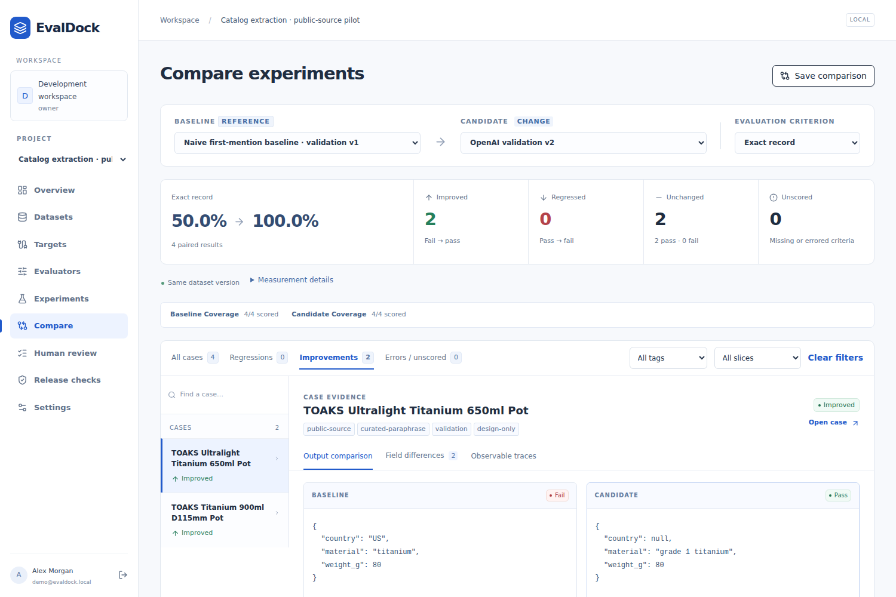
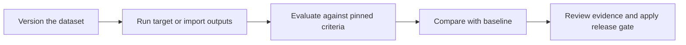

<p align="center">
  
</p>
<h1 align="center">EvalDock</h1>
<p align="center">
  <strong>A workbench for engineers to evaluate application behavior and catch regressions before release.</strong>
</p>
<p align="center">
  <a href="#quick-start">Quick start</a> · <a href="docs/README.md">Documentation</a> · <a href="CONTRIBUTING.md#reporting-bugs">Report a bug</a>
</p>



## Why EvalDock exists

A promising output does not establish whether a prompt, model or application change improves the whole system. EvalDock brings versioned datasets, targets, evaluation criteria and human reviews into repeatable experiments, so release decisions can be traced to case-level evidence.

## What it does

- **Compare changes:** pair baseline and candidate results, filter regressions and inspect field-level differences.
- **Preserve evidence:** retain versioned inputs, outputs, attempts and independent human assessments.
- **Check releases:** enforce score, coverage, error and regression limits; export JSON/JUnit reports for CI.
- **Connect applications:** call JSON HTTP targets, use OpenAI structured generation, or import existing outputs and traces.

## How it works



Only case input goes to the target. Evaluators receive their configured reference or context; human judgments remain separate. Saved outputs can be rescored without calling the target again.

## Quick start

### Requirements

- Docker with Compose v2.
- Python 3.12+ for local configuration; application runtimes run inside Docker.
- On Windows, run the commands in WSL.

### Installation

From the downloaded or cloned repository root:

```bash
python3 scripts/configure.py
docker compose up -d --build
docker compose exec -T api uv run python -m evaldock.seed
```

Open [http://localhost:5188](http://localhost:5188). Sign in as `demo@evaldock.local` using `DEMO_PASSWORD` from the generated root `.env`.

Configuration generates local secrets and preserves an existing `.env`. The seeded catalog and support examples are deterministic and require no provider key. See the [workflow guide](docs/WORKFLOWS.md#start-locally) for ports and troubleshooting.

## Usage and CI

1. Open **Catalog extraction** and launch a baseline with its dataset, baseline target and release suite.
2. In the completed report, expand **Run details & actions** and choose **Pin baseline**.
3. Launch a candidate with the same dataset and suite. Open **Compare** to inspect improvements and regressions.
4. Review a case, then open **Release checks** to apply the saved policy or export a report.

For CI, install uv and Python 3.12+, create a workspace token in **Settings**, and replace `EXPERIMENT_ID` with a completed candidate run:

```bash
uv sync --frozen
export EVALDOCK_URL=http://localhost:5188
export EVALDOCK_TOKEN='your-workspace-token'
uv run evaldock gate EXPERIMENT_ID --metric field_accuracy
```

Exit codes: **0** passed, **1** quality failure, **2** infrastructure or configuration error. See [CLI and CI](docs/WORKFLOWS.md#cli-and-ci) for running experiments and exporting JSON/JUnit reports.

## Evaluation evidence

The public-source catalog pilot tests material, weight and origin extraction on twelve curated product passages: eight calibration cases and four validation cases. Six deterministic criteria check schema validity, field accuracy and exact records; an advisory AI judge checks source support.

The initial judge accepted two incorrect controls. After a versioned rubric and input-scope revision, it accepted **8/8 correct controls** and rejected **8/8 incorrect controls**. All seven criteria passed for **4/4 validation records**. The pilot's release gate uses only the deterministic criteria.

These results cover a small, curated, non-blind pilot. Controls were reused during tuning and validation cases were visible during authoring; the results do not establish performance on unseen catalogs. The linked methodology records the dataset provenance and review scope.

[Method and results](docs/AI-CALIBRATION.md) · [Frozen plan](docs/catalog-ai-v2/plan.json) · [Machine-readable results](docs/catalog-ai-v2/summary.json)

With the local stack running and the pilot and credentials already prepared, validate its configuration against the frozen plan without model calls:

```bash
uv run python scripts/calibrate_catalog_ai.py preflight
```

See [AI setup](docs/AI-READINESS.md) for preparation and [resumable phases](docs/AI-CALIBRATION.md#resume-without-duplicate-requests) for executing the pilot. Live runs incur provider charges.

## Architecture and engineering decisions

| Area | Technology | Responsibility |
| --- | --- | --- |
| Application | Vue 3, TypeScript, Vite, FastAPI | Editors, comparison UI and scoped API |
| Data | PostgreSQL 17, SQLAlchemy, Alembic | Versioned resources, results and audit records |
| Jobs | Procrastinate, PostgreSQL | Durable execution, retries and worker recovery |
| AI | OpenAI Responses API, Pydantic, JSON Schema | Structured generation and validated judgments |
| Observability | Persisted events, attempts and usage metadata | Progress, failures, latency and token usage |
| Local runtime | Docker Compose, nginx | Run the stack and proxy same-origin requests |

### Immutable experiment inputs

Experiments pin dataset, target and evaluator versions so later edits cannot change earlier evidence. Updates create new versions, trading storage for reproducibility. Human assessments are appended without replacing automated judgments.

### Durable execution

A PostgreSQL outbox and durable worker recover interrupted dispatch. Separate target and evaluator attempts let evaluation retries reuse saved outputs. External calls are **at least once**: targets must honor configured idempotency keys to prevent duplicate side effects. See [architecture and delivery semantics](docs/ARCHITECTURE.md).

### Security boundaries

Workspace roles and scoped, expiring tokens control access. Sessions use HttpOnly cookies and CSRF checks. Stored credentials are encrypted; the prepared OpenAI key stays in the server environment. HTTP adapters validate destinations and enforce request limits. See [security boundaries and limitations](docs/SECURITY.md).

## AI behavior

Live AI is optional; deterministic fixtures and imported-output evaluation work without provider credentials when using offline evaluators.

| Area | Approach |
| --- | --- |
| Model support | OpenAI structured generation and judging; JSON HTTP adapters for other applications |
| Structured output | JSON Schema for generation; Pydantic-validated judge responses |
| Failure handling | Bounded attempts; refusals and invalid output remain errors, with no fixture fallback |
| Data handling | Case input goes to the target; judges receive their versioned evidence scope. Outputs and judgments persist in the local deployment |
| Usage controls | Target-call budgets, target concurrency/rate limits, output-token caps and recorded token usage |

For live AI, prepare the pilot and set `OPENAI_API_KEY` in the root `.env` as described in the [AI setup guide](docs/AI-READINESS.md).

## Limitations

- Local/team deployment; no public hosted demo, enterprise SSO or managed backup/retention workflow.
- HTTP targets support synchronous JSON POST only; no streaming or asynchronous target protocols.
- No dollar-budget enforcement or price estimates; cost stays unavailable unless reported by a target/provider.

## Project status

The local workflow is implemented and verified for portfolio demonstration: **78 backend tests**, **13 frontend tests** and **6 browser journeys** passed, along with lint, type checking and the production build. The live AI pilot is documented above; its configuration preflight also passed.

See [verification commands](CONTRIBUTING.md#checks) and the [desktop and mobile review](docs/UX-REVIEW.md) for coverage.

## Contributing

Read [CONTRIBUTING.md](CONTRIBUTING.md) for setup, checks and contribution guidelines. Report security concerns privately as described in [SECURITY.md](docs/SECURITY.md).

## License

Licensed under the [MIT License](LICENSE). Dependencies retain their respective licenses.
