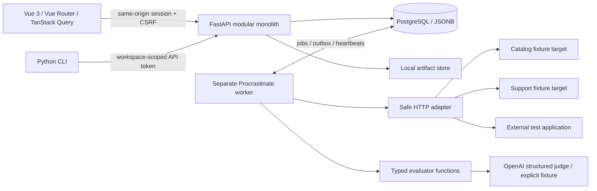

# Architecture

## Modules

`security` implements identity, memberships, sessions, tokens and encryption. `datasets` owns version creation and resource constraints. `targets` owns JSON Pointer mapping and network requests. `evaluators` contains typed scoring functions with no ORM/HTTP-handler dependence. `execution` owns experiments, per-case attempts, cancellation and rescoring. `worker` provides durable queue delivery and recovery. `measurement` owns aggregation, paired comparison and CI decisions. `reports` provides artifacts and persisted-data projections. `api` exposes these through scoped routes and audits.

## Data model

Workspaces contain users through owner/editor/viewer memberships and contain projects. Membership grants access to projects in that workspace. Project-scoped resources have a constrained kind (`dataset`, `target`, `evaluator`, `suite`). A resource's immutable versions hold its validated configuration. Test cases are relational children of dataset versions, with unique stable case IDs and fingerprints.

Experiments reference exact dataset, target and suite versions. PostgreSQL triggers enforce immutability and ensure these version kinds belong to the experiment's project. Baseline and parent references stay in that project. Suite versions reference exact immutable evaluator versions validated at creation. The API has no update/delete endpoint for version content.

Executions are unique on experiment, case ID and replicate. Attempts are unique on execution, phase, evaluator version and attempt number. Evaluator results are unique on execution, evaluator version and metric key. Human reviews are append-only assessments, not modifications of evaluator results. Other tables store credentials, baseline references, comparisons, gate configurations, artifacts, audit and progress events, and target throttles.

## Durable delivery

An experiment and its `dispatch_pending` outbox flag are committed together. A worker-side reconciler dispatches pending records to Procrastinate, then clears the flag. If the process dies between these commits, dispatch may repeat. A Procrastinate lock serializes deliveries for the same experiment, and completed execution states are skipped. Target output and target-attempt success are committed together. An evaluator retry uses the saved target output.

Procrastinate heartbeats detect workers stopped without a graceful shutdown. Reconciliation retries stalled jobs after a 30-second missing heartbeat, checked every three seconds. A normal stop lets in-flight jobs drain. PostgreSQL advisory locks enforce target-version concurrency across workers and a persisted throttle reserves request start times. Cancellation stops new work and records outputs from calls already in flight.

External requests cannot be made atomic with PostgreSQL. A kill after the remote endpoint executes but before the output commit can cause a duplicate call. EvalDock uses a stable idempotency key per execution where configured, but the target must implement that contract. This is at-least-once delivery, not exactly-once external execution.

## UI

Vue 3 Composition API, strict TypeScript, Vite, Vue Router, TanStack Vue Query, Tailwind and generated shadcn-vue button components. Lucide provides icons. All displayed experiment values come from persisted API data. Client-only form state uses local refs; a Pinia store is unnecessary. Authenticated polling refreshes experiment state, with persisted progress-event cursor endpoints for reconnectable consumers.

## Artifacts

`ArtifactStore` defines get/put; `LocalArtifactStore` writes report snapshots atomically under a private root. Downloads resolve an artifact ID, check its project's workspace membership, then read the stored key. Raw case outputs and structured traces remain JSONB in the MVP, bounded by HTTP limits. A remote object store implementation can be added without changing report authorization.
